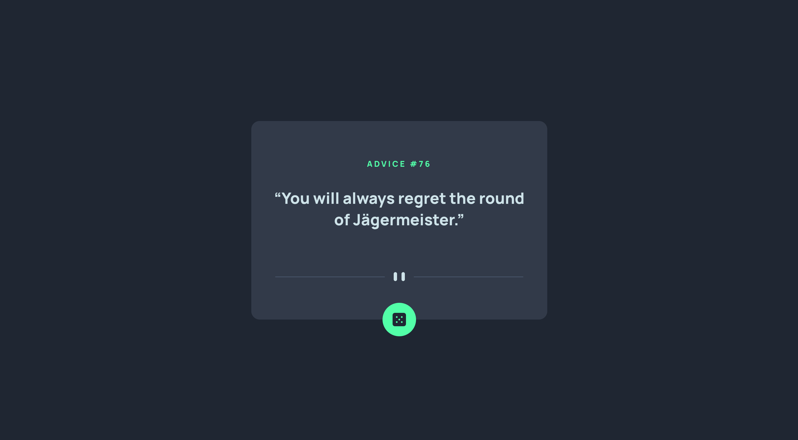

# Frontend Mentor - Advice generator app solution

This is a solution to the [Advice generator app challenge on Frontend Mentor](https://www.frontendmentor.io/challenges/advice-generator-app-QdUG-13db). Frontend Mentor challenges help you improve your coding skills by building realistic projects.

## Table of contents

- [Overview](#overview)
  - [The challenge](#the-challenge)
  - [Screenshot](#screenshot)
  - [Links](#links)
- [My process](#my-process)
  - [Built with](#built-with)
- [Author](#author)

**Note: Delete this note and update the table of contents based on what sections you keep.**

## Overview

### The challenge

Users should be able to:

- Load the page and view a random piece of advice returned by the Advice Slip API.
- Click the dice button (max: once every 1.5 seconds) and receive a new random piece of advice

Users should not be able to:

- Click the button more than once every 1.5 seconds

### Screenshot

### Links

- Solution URL: [https://jphiron.github.io/fem-advice-generator/](https://jphiron.github.io/fem-advice-generator/)
- Live Site URL: [https://github.com/jphiron/fem-advice-generator](https://github.com/jphiron/fem-advice-generator)

## My process

### Built with

- Semantic HTML5 markup
- Flexbox
- [Sass](https://sass-lang.com/) - CSS Preprocessor
- [React](https://reactjs.org/) - JS library
- [Styled Components](https://styled-components.com/) - For styles
- [Framer Motion](https://www.framer.com/motion/) - For component transitions

## Author

- Website - [Jack Hiron](https://www.jackhiron.dev)
- Github - [jphiron](https://www.github.com/jphiron)
- Frontend Mentor - [@jphiron](https://www.frontendmentor.io/profile/jphiron)
- Twitter - [@Hai_r0n](https://www.twitter.com/Hai_r0n)
